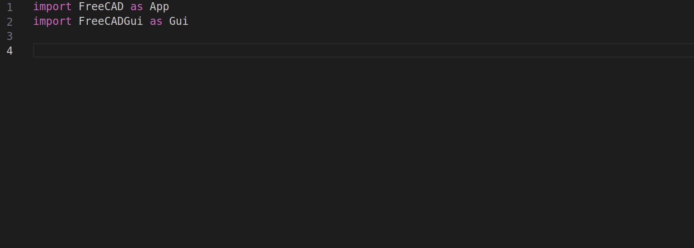

# freecad-stubs

FreeCAD [stub files](https://peps.python.org/pep-0484/#stub-files) for enhanced development experience in external editors such as VS Code and Neovim.

## Current Approach

Based on [CyrilWaechter/freecad-stubs](https://github.com/CyrilWaechter/freecad-stubs) which uses [mypy](https://mypy.readthedocs.io/en/stable/index.html) to automatically generate stubs.

This approach is limited.

For a more complex approach, see [Vanuan/freecad-python-stubs](https://github.com/Vanuan/freecad-python-stubs) and [Type-checked Python forum discussion](https://forum.freecad.org/viewtopic.php?t=49917).

## Installing Package

From the root of this repository:

    pip install --editable .

## Prerequisites

1. Install [Miniconda (conda)](https://docs.conda.io/en/latest/miniconda.html).

## Setup
Execute the following commands from the root of this repository.

1. Create `freecad-stubs` conda environment.

       conda env create --file environment.yml

2. Activate `freecad-stubs` environment.

       conda activate freecad-stubs

3. Add the `$CONDA_PREFIX/lib` directory to `$PYTHONPATH` (this allows `FreeCAD` to be imported as a module within python).

       ./add_conda_path_to_python_path.sh

4. Deactivate and re-activate `freecad-stubs` environment.

       conda deactivate && conda activate freecad-stubs

5. Verify `freecad` executable is accessible:

       freecad --version

## How to Upgrade FreeCAD Version
The version of FreeCAD is defined in `environment.yml` within the root of this repository.

1. Check if there's a newer version from FreeCAD's [GitHub releases page](https://github.com/FreeCAD/FreeCAD/releases) or [Wiki](https://wiki.freecad.org/Feature_list#Release_notes).
2. Increase version for `freecad` in `environment.yml`.
3. Remove `freecad-stub`s conda environment created in the "Setup" section.

       conda remove --name freecad-stubs --all

4. Reperform steps in the [Setup](#setup) section to recreate `freecad-stubs` conda environment.
